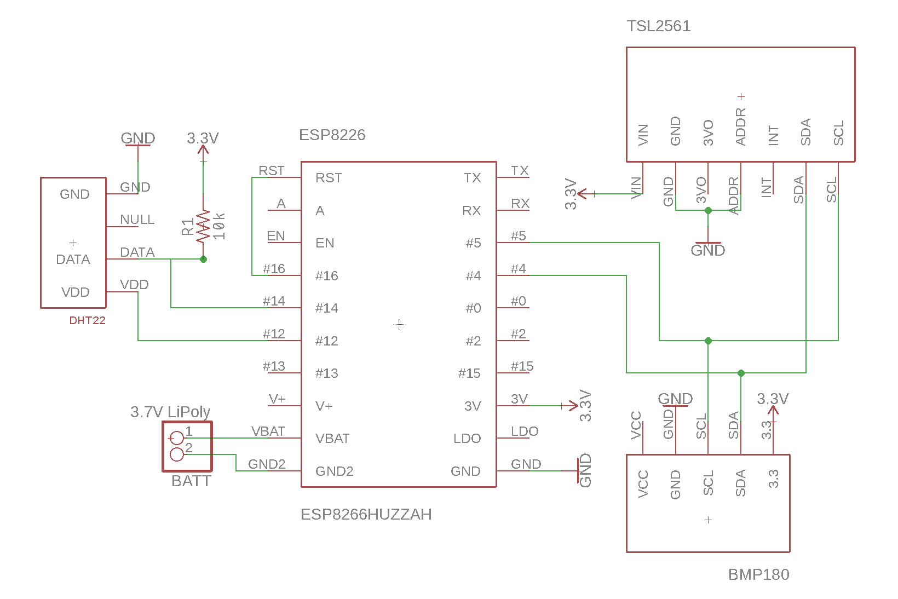
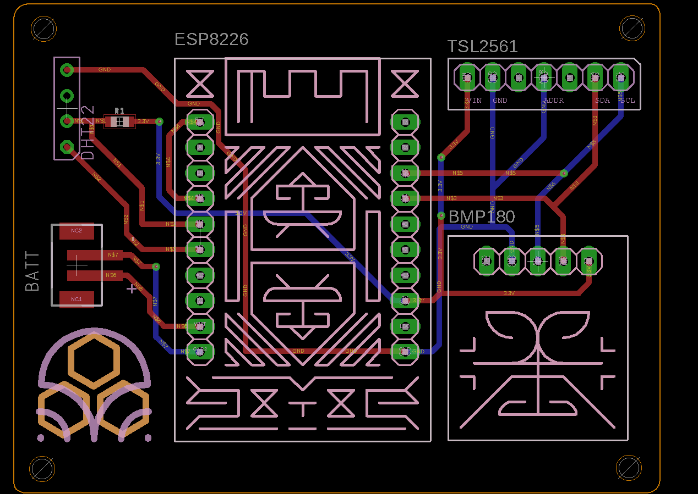
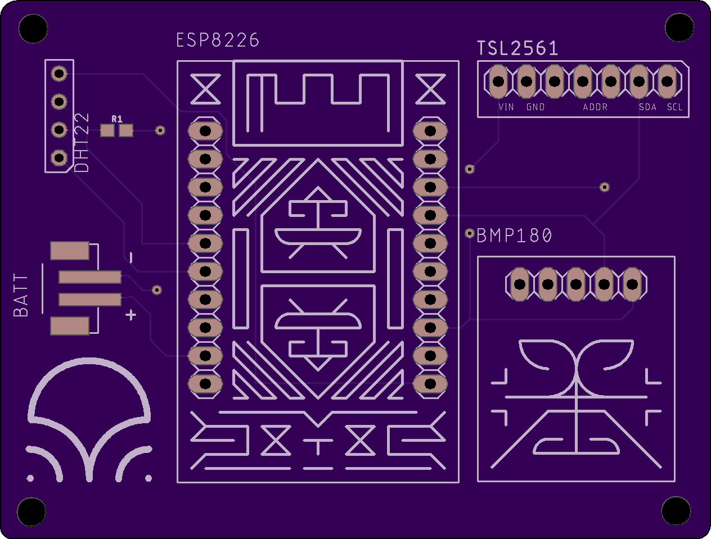
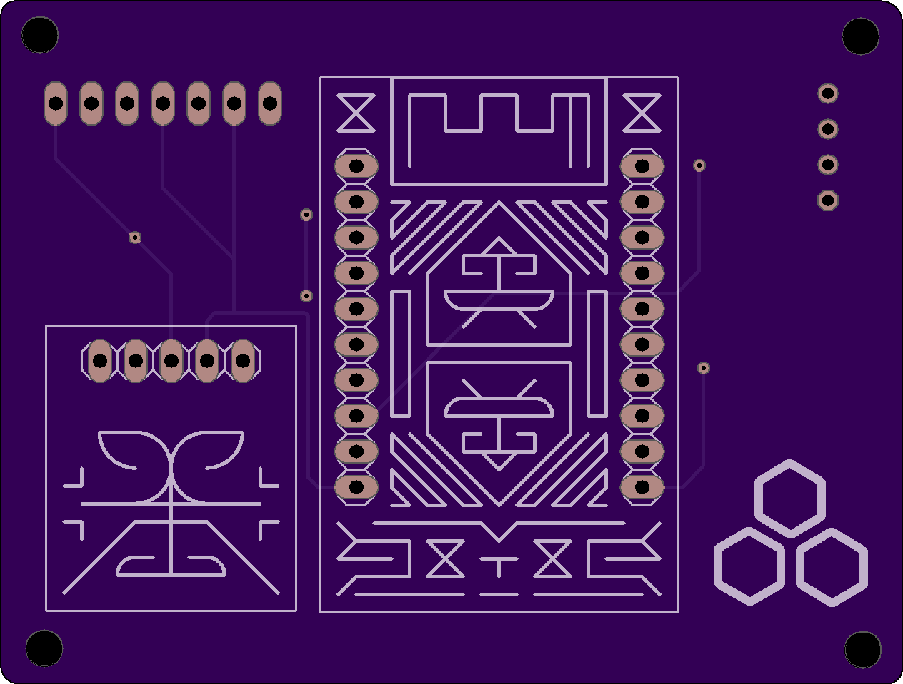
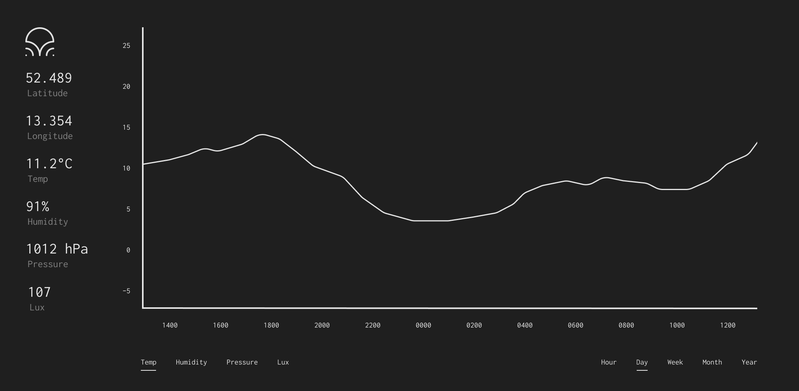

Regn is a weather station. It reads in temperature humidity,
atmospheric pressure and luminosity.

Hardware
========

- `ESP8266 Huzzah`_
- `DHT22 temperature & humidity sensor`_
- `BMP180 barometric pressure sensor`_
- `TSL2561 luminosity/lux/light sensor`_

Schematic
---------

PCB
---

Front
~~~~~

Back
~~~~

Software
========

Interface
---------

.. _ESP8266 Huzzah: https://cdn-learn.adafruit.com/downloads/pdf/adafruit-huzzah-esp8266-breakout.pdf
.. _DHT22 temperature & humidity sensor: https://www.sparkfun.com/datasheets/Sensors/Temperature/DHT22.pdf
.. _BMP180 barometric pressure sensor: https://cdn-shop.adafruit.com/datasheets/BST-BMP180-DS000-09.pdf
.. _TSL2561 luminosity/lux/light sensor: https://cdn-shop.adafruit.com/datasheets/TSL2561.pdf
