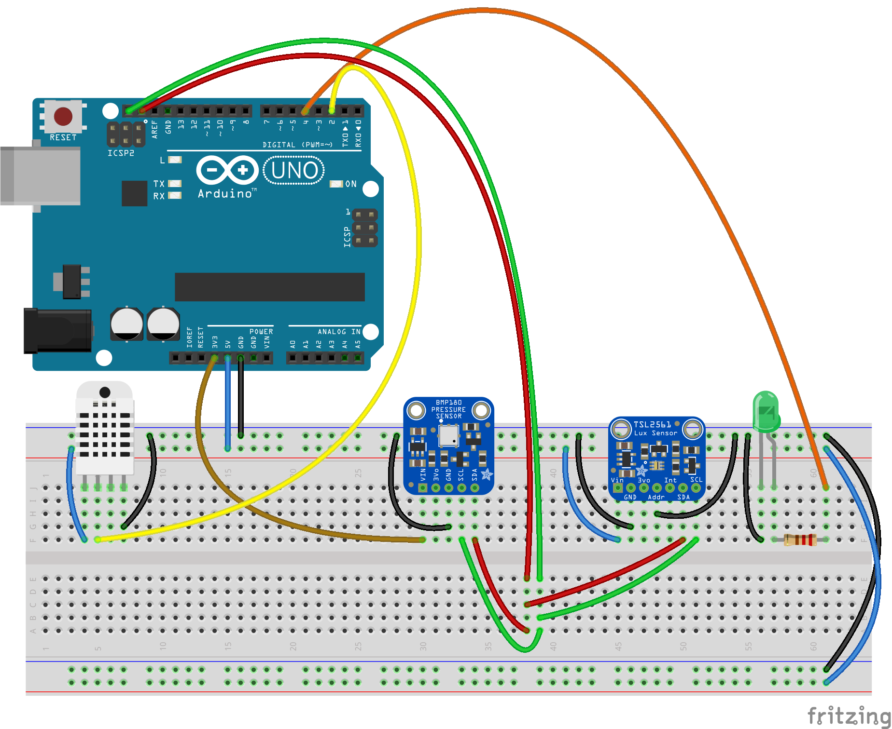
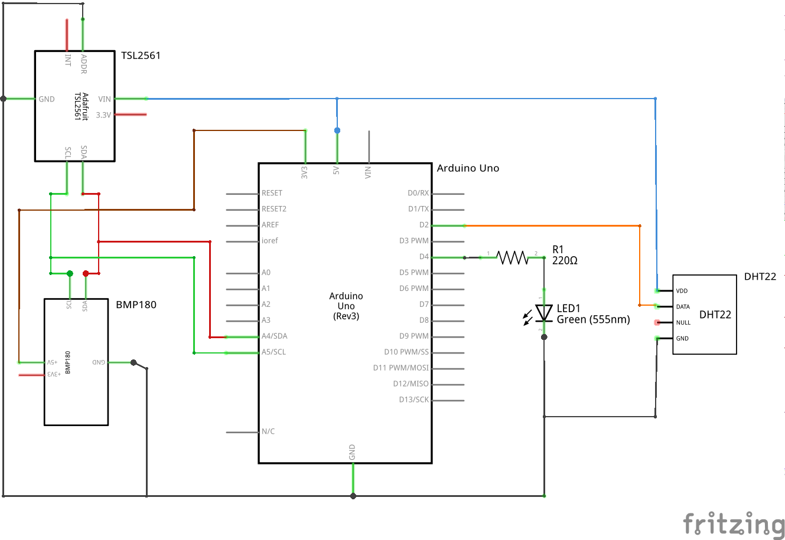

.. image:: seonu/_static/github_header.png
    :align: center

Regn is a weather station, built with Arduino. It reads in temperature humidity,
atmospheric pressure and luminosity.

Hardware
========

- Arduino Uno
- `DHT22 temperature & humidity sensor`_
- `BMP180 barometric pressure sensor`_
- `TSL2561 luminosity/lux/light sensor`_

Schematics
----------

Software
========

Interface
---------

.. image:: seonu/_static/interface.png

.. _DHT22 temperature & humidity sensor: https://www.sparkfun.com/datasheets/Sensors/Temperature/DHT22.pdf
.. _BMP180 barometric pressure sensor: https://cdn-shop.adafruit.com/datasheets/BST-BMP180-DS000-09.pdf
.. _TSL2561 luminosity/lux/light sensor: https://cdn-shop.adafruit.com/datasheets/TSL2561.pdf
